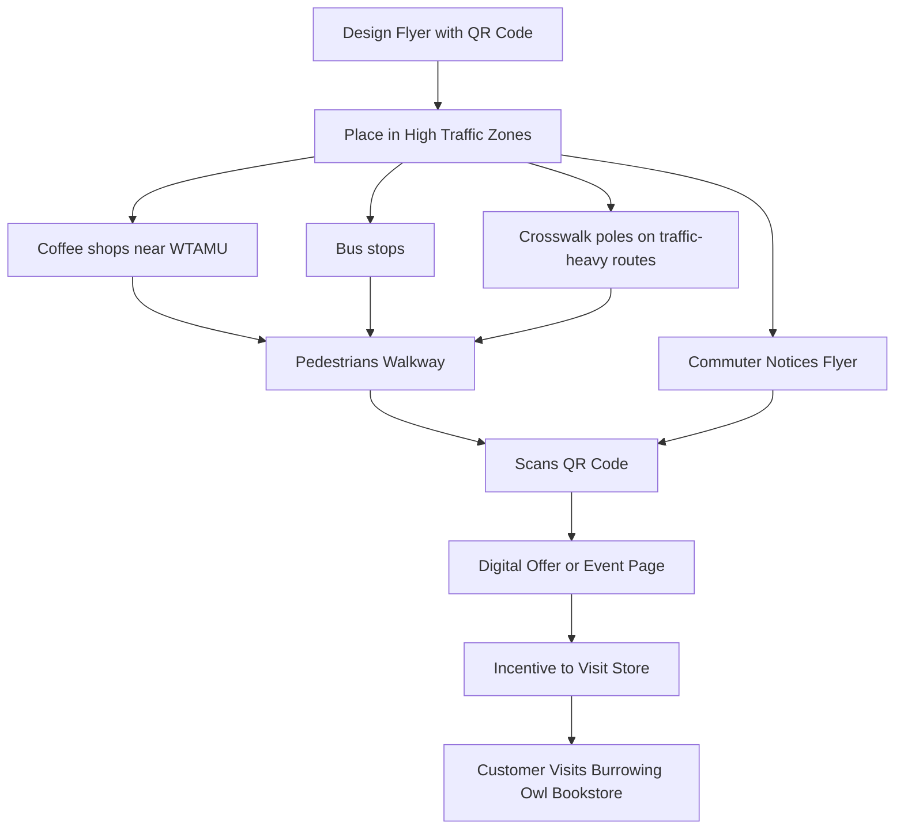
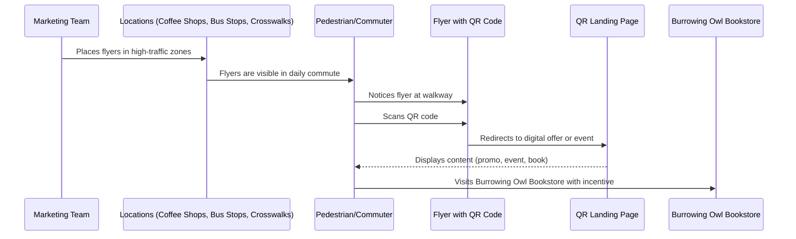
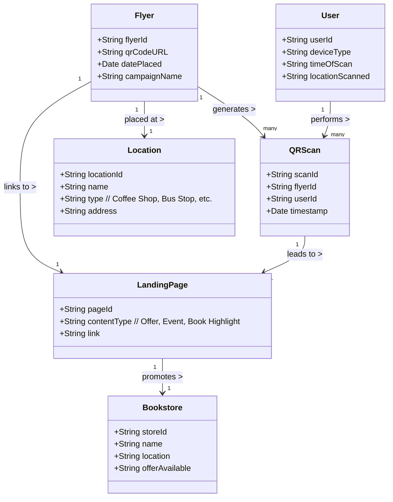
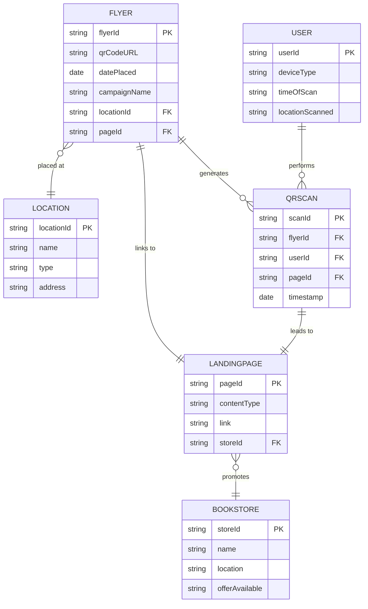

 Local Business Problem: Burrowing Owl Bookstore (Canyon, TX)

Problem Statement
How can a small, local bookstore like Burrowing Owl in Canyon, TX increase visibility and foot traffic in a town with limited population and digital ad fatigue using a low-cost, physical-to-digital ad solution during high-traffic local times?

Burrowing Owl Bookstore is a small independent bookstore located in Canyon, Texas — a town heavily dependent on the population of West Texas A&M University. Due to the town’s small size and a shift in consumer behavior (e.g. digital ad fatigue, online buying habits), the store struggles with visibility and customer engagement.

 Context:
- Canyon has a limited local population.
- Daily traffic jams occur between 5–6 PM as residents/students commute home to Amarillo.
- Traditional digital ads are often ignored by mobile users.

Objective

Develop a low-cost, scalable solution that increases foot traffic and engagement with the bookstore, using physical and digital touchpoints that align with the town's daily flow and behavior.

Solution: Micro-Zones Ad Network

A hybrid marketing system that blends **physical flyers** and **QR-based digital engagement**, targeting specific “micro-zones” with high commuter presence and student activity.

How It Works:
 FlowChart Diagram

Class Diagram 

Entity Relationship Diagram 

